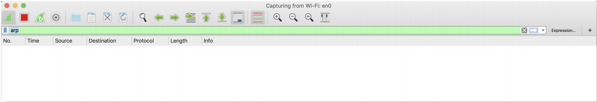
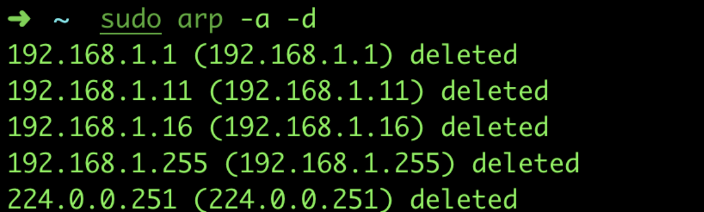
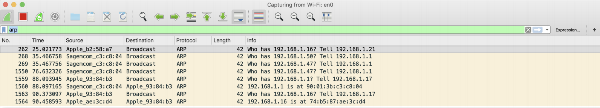
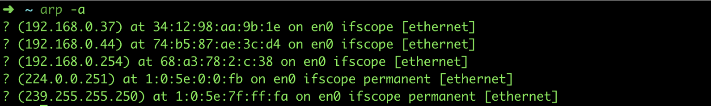
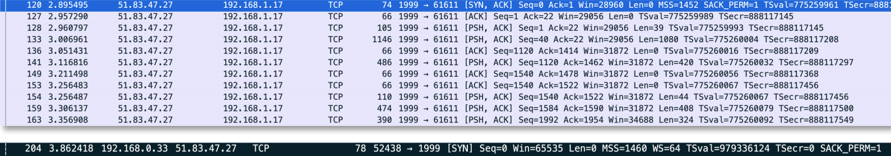
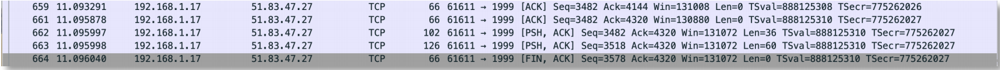
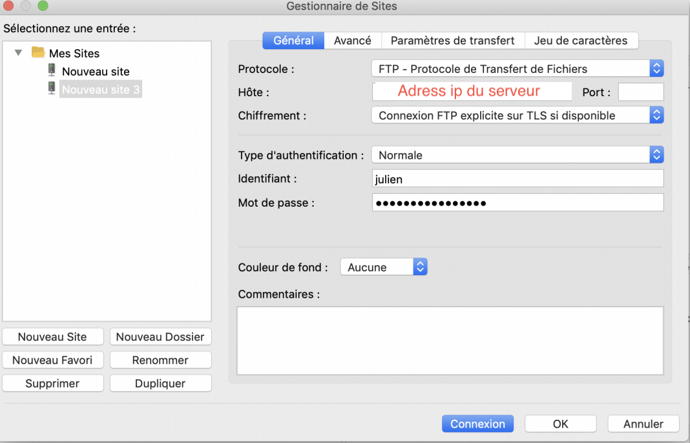
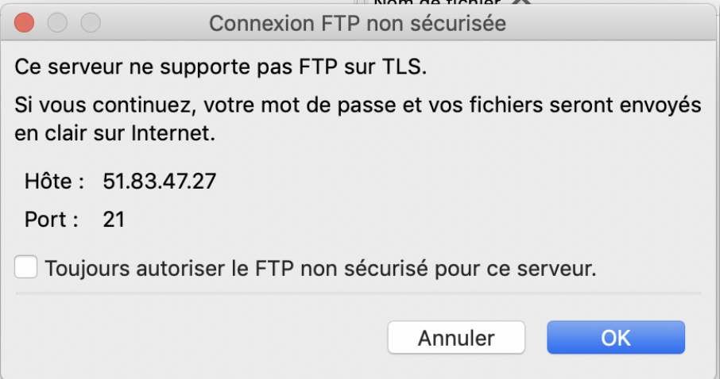
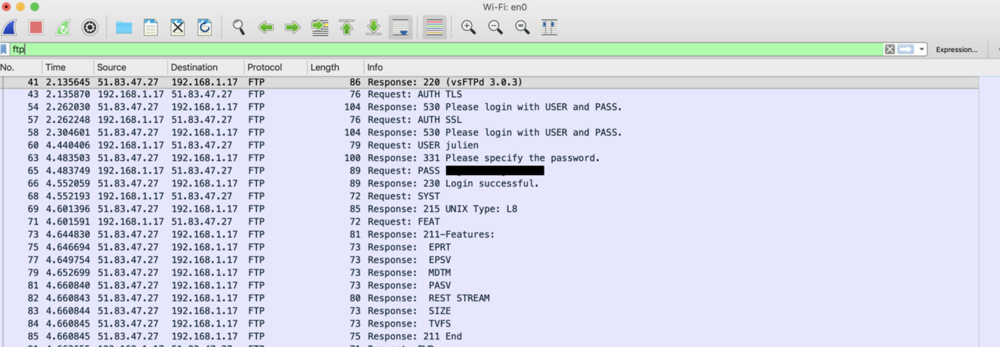

# Analyse réseau au service de la sécurité

On va découvrir le fonctionnement de 3 protocoles réseaux differents grace à Wireshark.

## Le protocole ARP

### 1- Fonctionnement

Le protocole ARP (Adresse Resolution Protocole) permet de connaitre l’adresse mac (Adresse physique) d’une carte réseau qui correspond à une adresse IP. Le protocole ARP demande aux machines voisines leur adresse physique puis créé ensuite une table sur laquelle il va les stocker (table ARP). On va voir son fonctionnement avec un test simple, on va sniffer le moment ou ARP fabrique sa table. On ouvre Wireshark et on lance un test, avec seulement les requêtes ARP.



On va supprimer les données qui sont déjà enregistrer dans la table ARP pour bien voir la découverte du réseau. Comme ça, on aura beaucoup plus de requêtes ARP.

```bash
sudo arp -a -d
```



Une fois le cache ARP nettoyé, on retourne sur Wireshark :



On voit ici que le système MacOs envoie des requête ARP à tout le monde (en Broadcast, il demande par exemple « Qui est 192.168.1.16, demande 192.168.1.21 » et il reçoit une réponse « 192.168.1.16 et à 74:b5:87:ae:3c:d4 » Les informations sont de nouveau enregistrées dans le cache ARP.



### 2 - Vulnerabilités

L’ARP est un protocole vulnérable à des attaques de type ARP spoofing (Usurpation d’ARP) qui permettent de se faire passer pour une machine cible et donc de détourner et de modifier des paquets entre un utilisateur et son routeur par exemple. Il est à l’origine des attaques MITM (Man In The Middle) ou un attaquant s’interpose entre votre machine et votre routeur pour voler des informations.

### 3 - Sécurisation

On peut utiliser ARPwatch2 ou arpalert pour surveiller les différents paquets ARP qui transit sur le réseau. On a aussi shARP, un petit outil en shell script qui permet de détecter les attaques ARP. Il dispose de deux modes, le premier qui permet de désactiver la carte réseaux d’une machine victime d’une attaque ARP, et le second qui utilise Airmon-ng et Aircrack-ng et tente de sortir l’attaquant du réseau en envoyant des paquets de désauthentification. Toutes les attaques qu’il détecte sont stockés dans un fichier de logs.


## Les sessions TCP

### 1- Fonctionnement

Nous allons établir une connexion SSH avec le VPS et sniffer le réseau avec Wireshark pour comprendre le fonctionnement d’une session TCP



On voit la première requête avec un flag SYN (demande de synchronisation ou établissement de connexion, permet la synchronisation des numéros de séquences.) On a une réponse SYN-ACK du serveur, puis un ACK du client A la fin de la session (quand on se déconnecte du serveur) on a une requête avec un flag FIN (demande la fin de la connexion.)



Les numéros de séquences permettent de personnaliser le dialogue entre les machines et de vérifier que les interlocuteurs TCP sont bien les bons. Le numéro de séquence s’incrémente à chaque paquet échangé entre deux machines. Ils sont utilisés avec le numéro d’acquittement et le nombre d’octet du dernier paquet pour ajouter une sécurité au protocole. 

### 2 - Vulnerabilités

Cependant, TCP est vulnérable à certaines attaques comme les attaques de type SYN-flood. On a vue qu’une session TCP normal fonctionne en 3 étapes : un client qui commence par envoyer un SYN, puis un serveur qui répond avec un SYN-ACK, et pour finir le client envoie un ACK pour finir d’établir la connexion. Certains pirates n’effectuent pas la dernière étape et donc le serveur reste en attente du dernier ACK. Il attend 75 secondes pendant lesquels l’attente du dernier ACK consomme des ressources. Si cette opération est répétée plusieurs fois elle peut empêcher le serveur de recevoir de nouvelles requêtes et donc un client légitime de se connecter.

### 3 - Sécurisation

Pour empêcher ça on peut limiter le nombre de SYN provenant de la même adresse IP auquel le serveur répond. On peut aussi analyser les logs mais il difficile de détecter une attaque comme celles-ci.

## Protocole FTP

###1- Fonctionnement

On va utiliser FileZilla sur MacOs, donc on ouvre Filezilla et wireshark, Sur Filezilla on crée une nouvelle connexion, on remplit les informations de notre VPS



Avant de cliquer sur connexion, on lance wireshark

Déjà on voit que FileZilla nous met en garde sur le fait que les fichiers vont être envoyés en clair.



Et quand la connexion est établie, on arrête le sniff Wireshark et on recherche uniquement le protocole FTP.



On voit directement le login et mot de passe en clair transiter entre le VPS et le client.

### 2 - Vulnerabilités

On constate que FTP est très vulnérable, pas besoin d’aller très loin pour le comprendre puisque l’on vient de voir un nom d’utilisateur et un mot de passe passer en clair dans Wireshark. FTP est vulnérable à d’autre attaques comme le vol de port, on peut intercepter un transfert en trouvant les ports sources utilisés à cause de séquences prévisibles.

###3 - Sécurisation

Pour éviter ce genre de problème on peut déjà faire en sorte de hacher le mot de passe pour éviter qu’il passe en clair.

On peut utiliser SFTP qui permet d’encapsuler notre transfert FTP dans un tunnel SSH. Sur Filezilla, on peut simplement choisir entre FTP et SFTP, on a aussi la commande scp qui fonctionne sur environnement linux et MacOs :

```bash
sudo scp -P 1999 /Users/julienbonnanfant/Desktop/test_sftp julien@adressServeur:/usr
```

On a aussi FTP/S qui ajoute une couche SSL ou son successeur TLS qui, comme HTTPS avec HTTP, permet de faire passer les transferts FTP par un canal chiffré.

***Publié le 1 juillet 2019***

