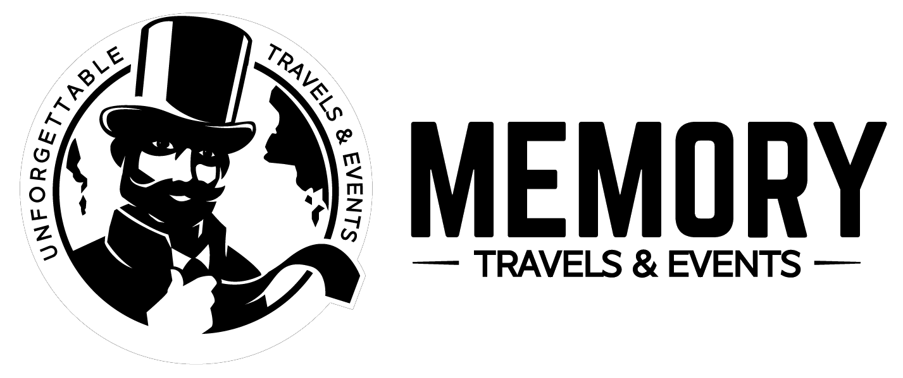
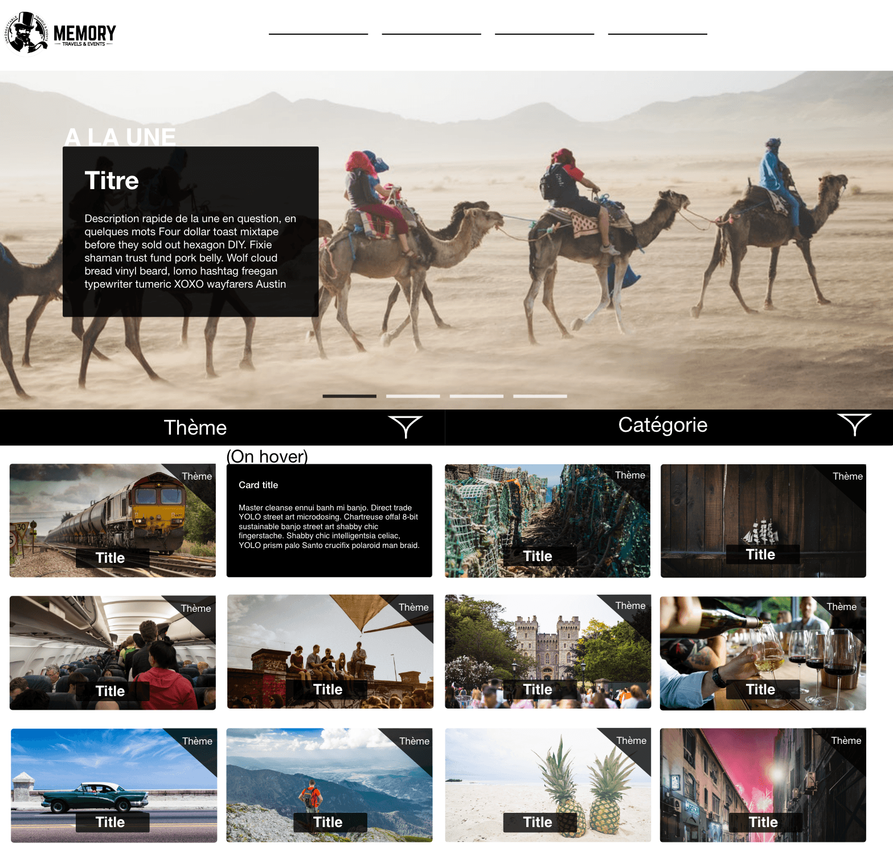

# Memory

Mon stage de fin de deuxième année à été effectué chez Memory Travel&Events, c'est une start-up Lyonnaise qui propose des voyages originaux, "WTF" à ses clients.

## Qui sont-ils ?

Memory est une agence de voyage lyonnaise, elle est née en 2017. Aujourd'hui, elle organise des séminaires, des enterements de vie de jeunes Garcons/Filles, des anniversaires et propose une multitude d'activités plus étonnantes les unes que les autres.  
Avec memory, on peut aller conduire un tank, se faire interroger par des agents du kgb, allez se baigner dans de la bière, chevaucher un avion, visitez Prypiat, etc..

La liste des activités et longue, si elle vous intéresse, vous pouvez la retrouver [ici](https://www.memoryvoyage.com/activity-categories)

## Quel était mon rôle ?

Pendant ce stage j'ai dû réaliser un blog pour memory, ils disposent déjà d'un site web [memoryvoyage](https://www.memoryvoyage.com/) mais ils ont besoin d'un blog pour pouvoir partager des articles sur des évènements qu'ils ont organiséPour faire ce blog, je n'avais rien qui m'était imposer au niveau des technologies à uttiliser donc j'ai décidé de faire un site Wordpress.

## Réalisation 

Avant de me lancer dans le développement du blog, j'ai réalisé des maquettes design sur adobe XD en essayant de respecter au mieux la charte graphique qui était déjà en place sur le premier site, tout en ne copiant pas exactement les differents design pour que l'uttlisateur ne confonde pas les deux site (blog et site principal)

														Voici un exemple des maquette que j'ai réalisé

Une fois la maquette faites sous adobe XD, je l'ai reproduite en Html/css pour pouvoir ensuite fabriquer un thème WordPress propre à Memory. 

Pour terminer, j'ai intégré cette maquette sur un wordpress en remplacant tout les elements statics par des éléments wordpress dynamiques.

## Méthodes de travail ?

Je travaillais dans une petite équipe, l'entreprise Memory ne dispose pas encore de locaux, les différents membres travails donc à distances. La major partie des comunications et des livraisons ce sont dérouler via discord. Environ toutes les semaines, j'ai fait des compte rendu du travail effectué au directeur informatique qui me fait un retour.

***Publié le 14 aout 2019***

