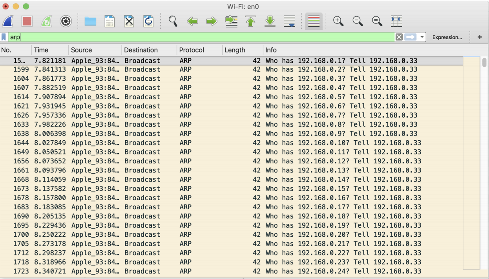
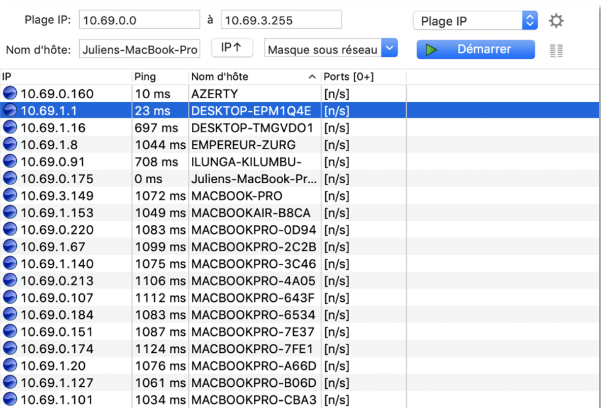
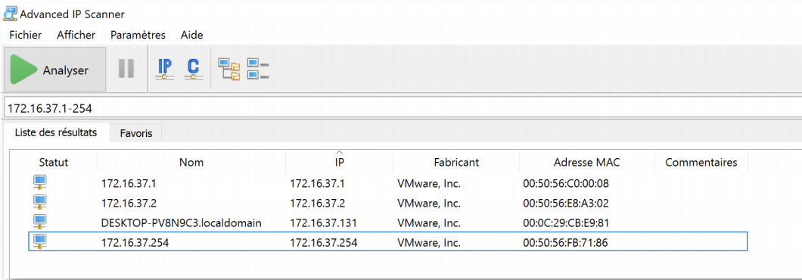
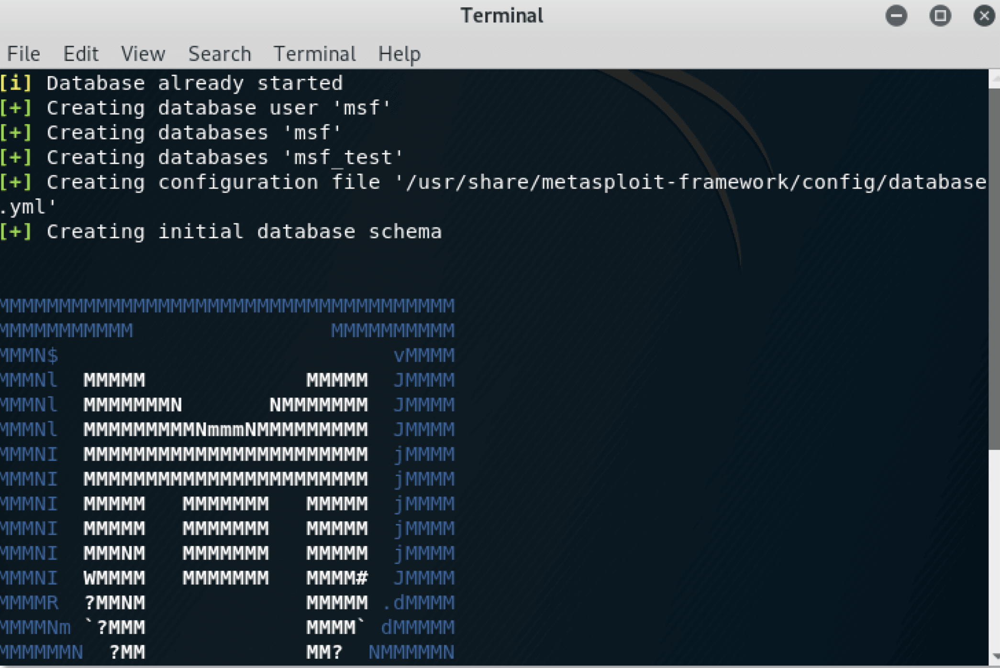
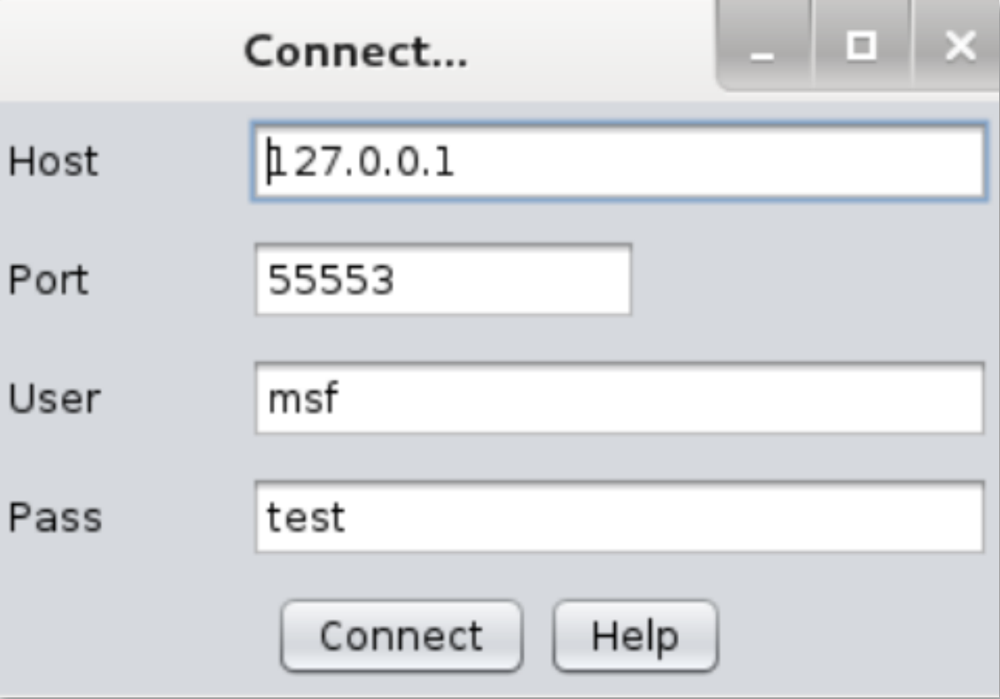
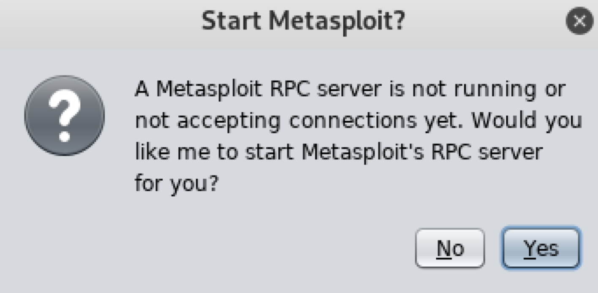
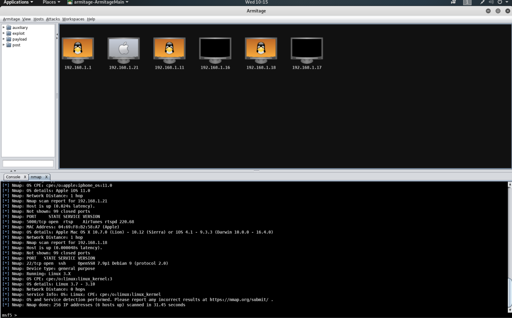
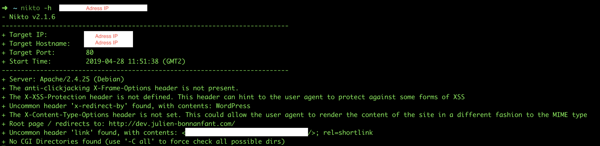

# Le scanneurs de reseaux 

Un scanner de réseaux permet de découvrir les hôtes qui sont connectés sur le réseau, comme on peut le remarquer lorsque on sniff le moment où on scan le réseau, il envoie des requêtes ARP en broadcast à tout le réseau et attend les réponses.




Ici nous allons tester différents scanneurs de réseaux, sur MacOs, sur Windows, kalilinux et sur mobile.


## Sur mac os

On va utiliser Angry IP scanner, il est très simple d’utilisation, il vous suffit de rentrer la plage d’adresse IP que vous souhaitez scanner et il va vous ressortir tous les hôtes qui sont Up sur le réseau.




Il permet de trouver l’adresse IP, le nom d’hôte et la vitesse de Ping entre notre machine et celles-ci. On s’en sert surtout pour trouver la liste de toutes les machines sur le réseau Une fois que l’on a une liste d’hôtes on peut voir quel port utilise quels services grâce à Nmap par exemple.


## Sur Windows

Pour Windows on peut faire la même chose avec Advanced ip scanner par exemple les deux logiciels sont sensiblement les mêmes, on voit apparaître les différentes machines up sur le réseau. Je trouve que la manière de renseigner la plage d’adresse ip est juste un petit peu moins explicite que sur AngryIP. Par contre on voit que les machines qui sont UP, c’est plus agréable.



Une fois que l’on a les machines cibles on peut toujours utiliser Nmap pour en savoir un peu plus (Ports ouverts et différents services ainsi que leurs versions.)

## Sur kali linux

Sur kali-linux en interface graphique on a Armitage qui peut faire la même chose, au départ, c’est une interface graphique pour Metasploit, mais il dispose d’énormément de fonctionnalités. Il permet, en utilisant Nmap, de voir les machines cibles et les différents exploits, puis Payload que l’on peut effectuer sur les ports de ses machines On peut donc faire les différentes étapes vues précédemment, et même allez plus loin plus grâce à Armitage.

Il faut mettre les paquets à jours :

```shell
apt update
```

On Lance mysql : 

```bash
/etc/init.d/mysql start
```


 On va lancer Metasploit dans Application à Exploitation Tools à Metasploit.




Puis Armitage dans Application à Exploitation Tools à Armitage Une fois dans Armitage on va dans « Host -> Nmap Scan -> QuickscanOS »



Une fenêtre de connexion apparaît et les informations sont déjà remplies, il faut appuyer sur « Connect », puis sur la fenêtre de dialogue suivant, cliquez sur YES




Le scan peut être un peu long, une fois terminer vous voyez les machines cibles sur votre réseau.



Cet outil est de loin le plus complet, si vous cliquez ensuite sur une des machines (Clic droit) et que vous choisissez de faire un scan, vous avez le détail des ports ouvert et des services qui les utilisent. Et pour finir, grâce à Metaploit et la Msfconsole accessible depuis Armitage, on peut directement tester les différents exploits sur les machines. Personnellement, je préfère cette méthode. Elle est peut-être un peu plus complexe, mais une fois en place, je trouve que le fait qu’elle réunissent les différents outils de l’analyse de réseaux, de port, jusqu’à l’exécution d’exploit sur les machines est extrêmement pratique.

## Depuis un smartphone (Android ou IOS)

L’application Fing est disponible sur Android et IOS et fonctionne très bien pour ce genre d’opération. Quand on ouvre l’application, elle va scanner automatiquement sur le réseau dans lequel le téléphone se trouve. On peut aussi le paramétrer si on souhaite.

Une fois que l’application à fait le scan du réseau, on peut aller voir les informations disponibles sur les hôtes (adresse IP, adresse mac, système d’exploitation, et marque), on peut aussi faire un Ping ou un Trace route sur la machine. Et pour finir on peut scanner les ports de la machine cible.


## Scanner de vulnérabilités web : Nikto

On commence par l'installation (je l'ai faite sur Mac OS) :

```bash
brew insall nikto
```

Par défaut, Nikto scan sur le port 80, on utilise la commande suivante pour scanner un serveur web. Si on veut scanner un port en particulier par exemple 443 pour HTTPS, on ajoute -p avec le numéro du port.

```bash
nikto -h AdresseIP ou URL
```




## Conclusion


Le scan de réseau et une étape fondamentale de la sécurité des systèmes d’informations, il permet de comprendre un peu la forme du réseau sur lequel on se trouve et de trouver les machines connecter à celui-ci. Une fois le scan de réseau réalisé, on enchaîne souvent sur un scan de port (ou balayage de port) pour connaître les ports ouverts sur la cible ainsi que les services qui les utilisent.

Du coté attaquant, avant de gagner l’accès sur une machine, on passe forcément par l’étape d’un scan réseau. Pour ma part, pour un scan réseau classique je me contente de l’application Fing sur mon téléphone qui est toujours sous la main et très complète, mais si je sais que j’aurais besoin d’aller plus loin (exploits, payloads) j’utilise directement Armitage sur Kali-linux pour gagner du temps.


***Publié le 20 Juin 2019***


